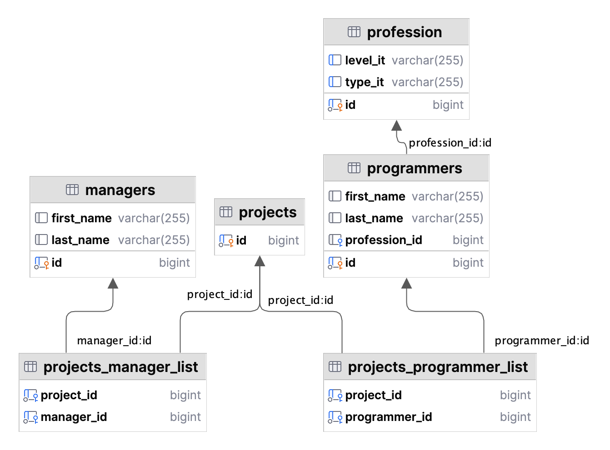

# ukrposhtaREST
You can use simple **RESTfull application**.
You have **managers** and **programmers**. Programmers have **professions**.
And most importantly, you have a project that they can complete.
Create a project! - add managers and programmers to projects.
YOU will be able to perform basic operations with these entities

1. The schema looks like this
!
2. Input in **application.properties**  all data to connect to the database
3. Create schema from file **init_db.sql** (if you use PostgreSQL)
4. You can use :
- MANAGERS:
  - create
  - update
  - getManagerById
  - delete
  - getAllManagers
- PROFESSION
  - create
  - getAllProfession
  - getProfessionById
  - delete
  - update
- PROGRAMMER
  - create
  - getProgrammerById
  - getAllProgrammers
  - delete
  - update
- PROJECT
  - create
  - getProjectById
  - delete
  - addManagerToProject
  - removeManagerFromProject
  - addProgrammerToProject
  - removeProgrammerFromProject
 
